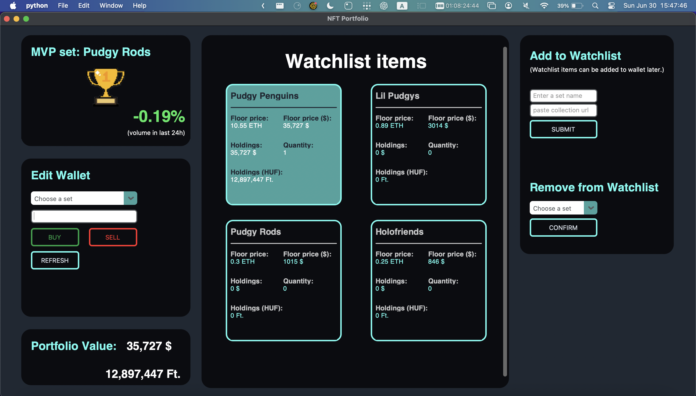
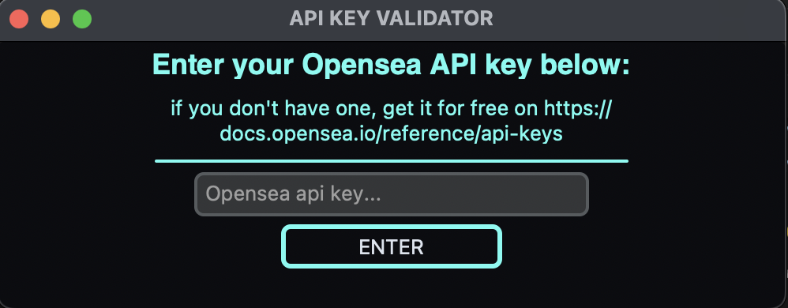

This Tkinter nft portfolio application can be used on **Mac**, **Windows** and **Linux**, thanks to CTkinter package in python.



## Features

- Add any NFT set from opensea.io to your watchlist, to track ethereum based nft sets.

- Add any NFT set from magiceden.io to your watchlist, to track solana based nft sets. Please only add Magiceden sets, that has a floor price in SOL, otherwise error can occur!

- Floor price in native currency, floor price in $ info available from every set

- Append your simulated portfolio with any set from your watchlist, to keep track of your nft sets worth in $ or HUF currencies.

- Track the total value of your portfolio in $ and HUF.

- Refresh live prices, including every nft set, ETH, SOL and USD - HUF price. It also re calculates the whole portfolio.

- MVP of the day: the set with the highest volume change (%) in 24h. Only Opensea nft included in this feature.

- Light / Dark mode, using the built in system setting from your device.


## Coming Features
- Export collectin as a csv file
- Dark / Light mode selector


## Installation
- install the newest version of python from (python.org) to your machine.
- clone this project
```sh
git clone https://github.com/brycebolton17/CTkinter-NFT-portfolio.git
cd CTkinter-NFT-portfolio
```

- install the requirments file with PIP
```sh
pip install -r requirments.txt
```
## Run the app
```sh
cd CTkinter-NFT-portfolio
python3 main.py
```
## Guide
Get an Opensea API key first
- You can register an opensea.io account to get a free api key. More info: https://docs.opensea.io/reference/api-keys

- (Magiceden doesn't require an API key)

Enter your api key (you must enter a valid key to bypass this window) after started the app:



